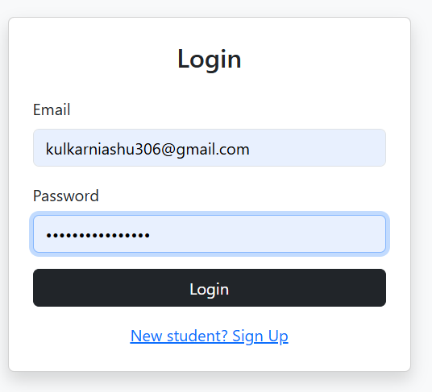
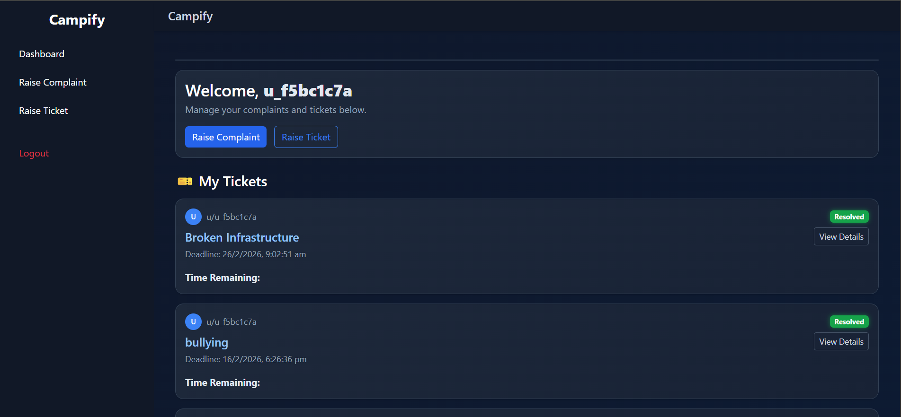
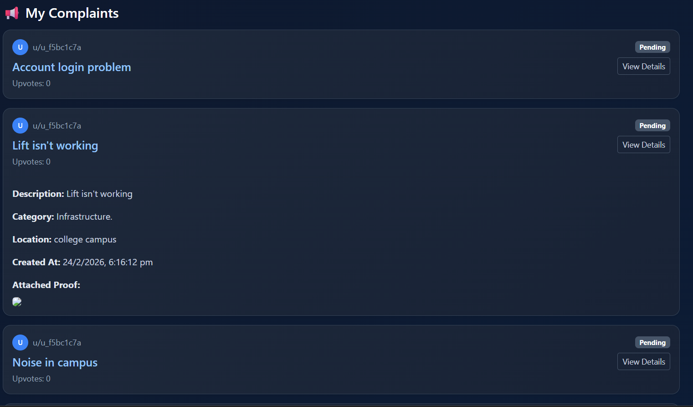
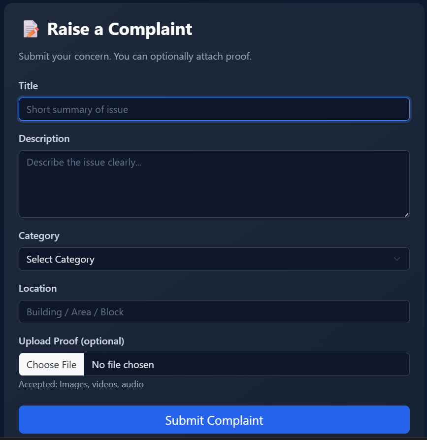
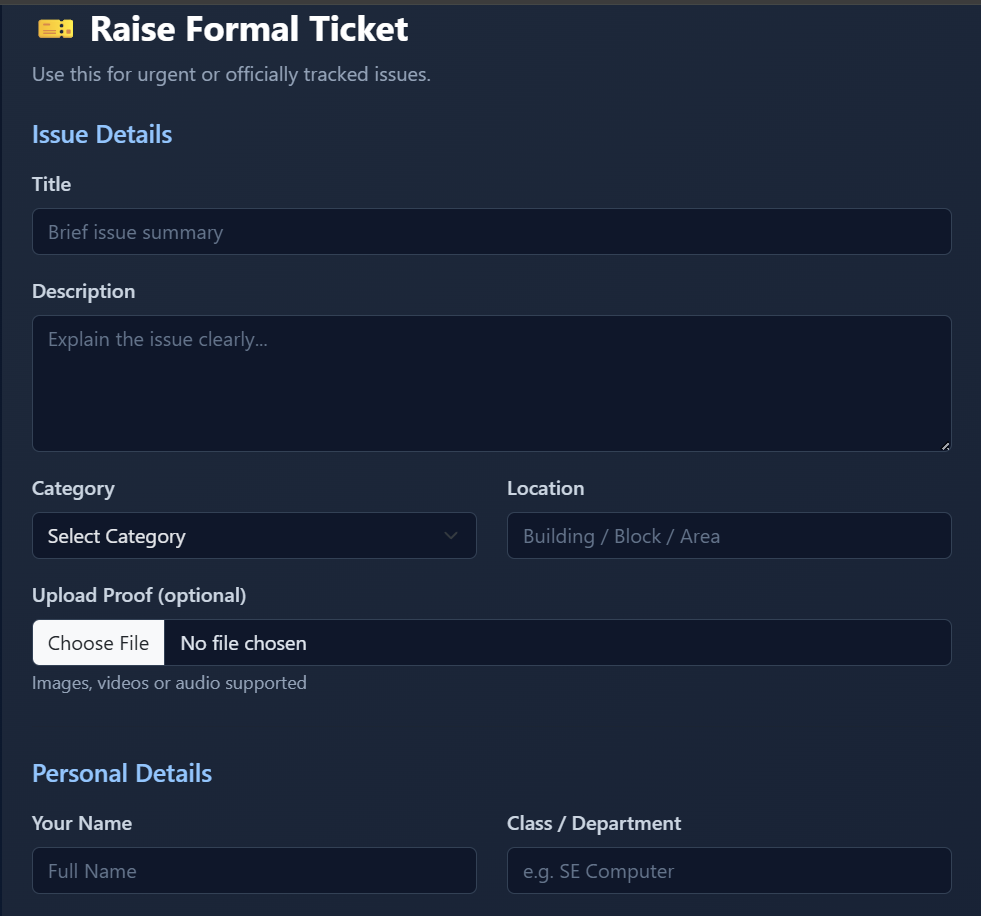
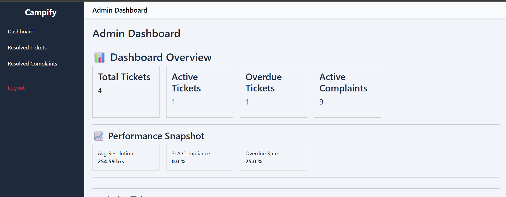
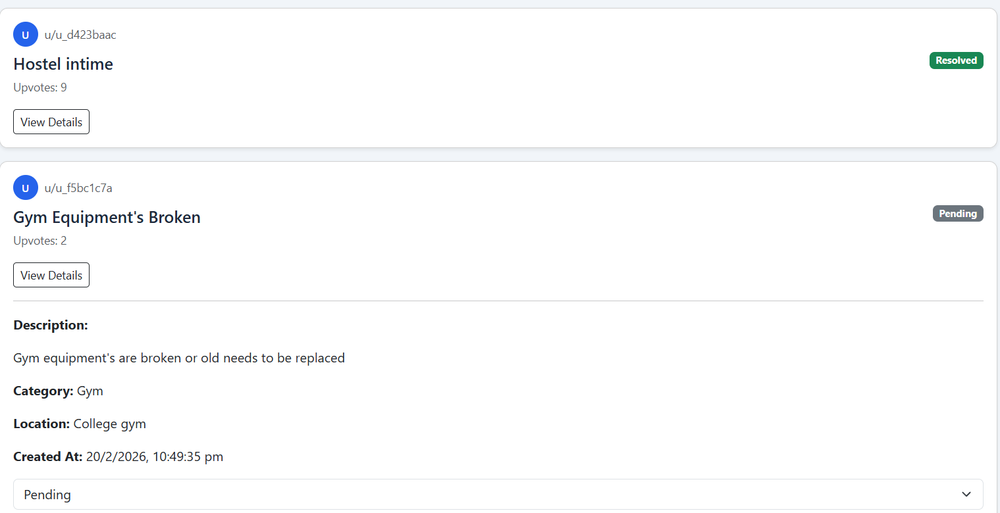
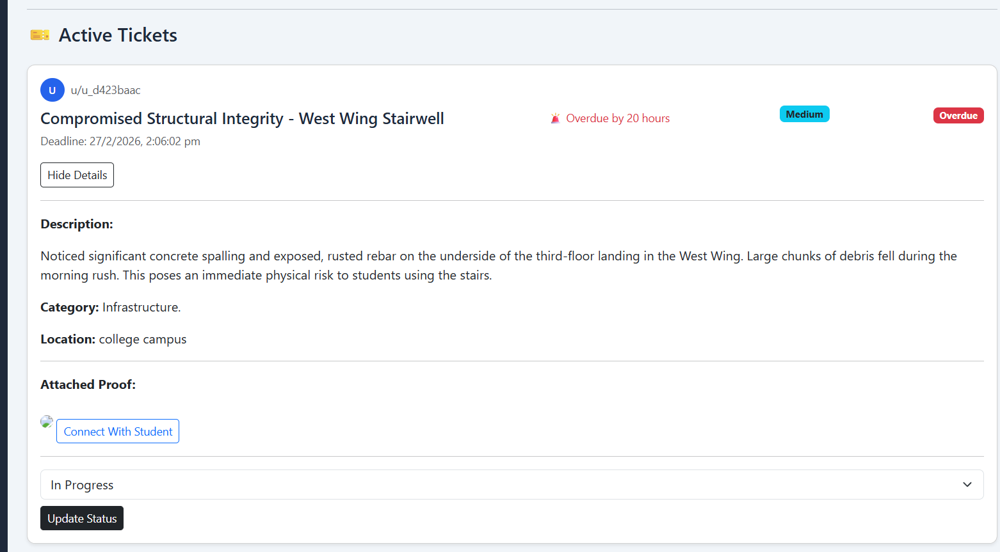

Campify – Campus Governance & Grievance Platform
---

## 📸 Application Screenshots

---

### 🔐 Authentication

  

---

## 🎓 Student Interface

### Dashboard & Complaint Overview

  
  

### Raise Complaint & Raise Formal Ticket (48h SLA)

  
  

---

## 🛠 Admin Interface

### Admin Dashboard & Complaint Management

  
  

### Ticket Monitoring & SLA Tracking

  

---

1) Overview

Campify is a semi-anonymous campus grievance management system that introduces transparency, prioritization automation, and SLA tracking in institutional complaint handling.

2) Problem

Students feel unheard

Administrators lack prioritization clarity

Traditional complaint systems are opaque

3) Solution

Campify introduces:

Persistent anonymous identities (NanoID)

Community upvoting

48-hour SLA ticketing

Automated priority scoring engine

Governance analytics dashboard

4)Tech Stack

Node.js

Express.js

PostgreSQL

EJS

Session-based Authentication

Multer (file uploads)

5) Key Features
a) Student

Raise complaints

Upload proof (image/video/audio)

Upvote complaints

Raise formal ticket (48h SLA)

View countdown timer

b) Admin

Dashboard analytics

SLA compliance tracking

Overdue rate calculation

Priority-based sorting

Governance performance metrics

6) Priority Engine

Priority score calculated based on:

Upvotes

Proof count

Ticket urgency

Overdue status

Sorted in descending order to assist decision-making.

7) Database Tables

users

complaints

complaint_proofs

complaint_votes

tickets

8) Setup Instructions
git clone <repo link>
npm install
create .env file
add DB credentials
npm start

 9)Future Enhancements

AI-based issue clustering

Sentiment analysis

Real-time notifications

Mobile app version

